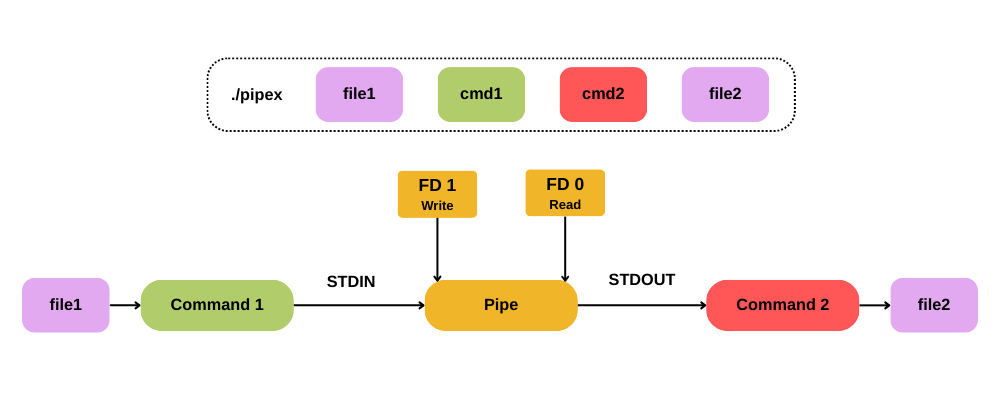

# 🛠️ Pipex 

### **42 Cursus — Milestone 2**

---

## 📜 À propos du projet
Le projet **Pipex** consiste à recréer en C le mécanisme des redirections (`<`, `>`) et des tubes (`|`) du shell Unix. C'est une plongée dans la manipulation des processus et des flux de données.

🚀 **TLDR** : Pipex permet de comprendre comment les données circulent entre les programmes en soudant des **File Descriptors**, en gérant des **Pipes** et en exécutant des binaires système via `execve`.

[Image of a diagram showing process fork and pipe redirection in C]

> **⚠️ Note sur la Norme 42** :
> * Fonctions limitées à **25 lignes** maximum.
> * Variables déclarées et alignées en début de fonction.
> * Utilisation stricte des fonctions autorisées (pas de triche).

---

## 🏗️ Architecture & Logique
Le programme agit comme un pont entre deux processus indépendants :

| Étape | Action Technique |
| :--- | :--- |
| **1. Entrée** | Ouverture du fichier source (`infile`) via un descripteur de fichier. |
| **2. Tunnel** | Création d'un canal de communication bidirectionnel avec `pipe()`. |
| **3. Fork** | Division du programme en processus "Enfant" et "Parent" pour exécuter les commandes en parallèle. |
| **4. Redirection** | Utilisation de `dup2()` pour brancher les flux sur le tunnel. |
| **5. Exécution** | Recherche du binaire dans le `PATH` et lancement via `execve()`. |



---

## 🔷 Partie Mandataire
Le programme doit reproduire exactement le comportement de la commande shell suivante :

`$> < file1 cmd1 | cmd2 > file2`

**Utilisation de Pipex :**
`$> ./pipex file1 "cmd1" "cmd2" file2`

---

## 🌟 Partie Bonus
Le bonus étend les capacités du programme pour gérer des scénarios plus complexes :

1. **Multi-pipes** : Supporte une chaîne infinie de commandes.
   `$> ./pipex file1 "cmd1" "cmd2" "cmd3" ... "cmdn" file2`
2. **Here_doc** : Simule la redirection `<<` et le mode "append" `>>`.
   `$> ./pipex here_doc LIMITER "cmd1" "cmd2" file2`

---

## 👨‍💻 Mode d'emploi

### Prérequis
Le programme nécessite le compilateur `gcc` (ou `clang`) et les bibliothèques C standards.

### 1. Compilation
```bash
make          # Compilation de la partie mandataire
make bonus    # Compilation incluant les fonctions avancées